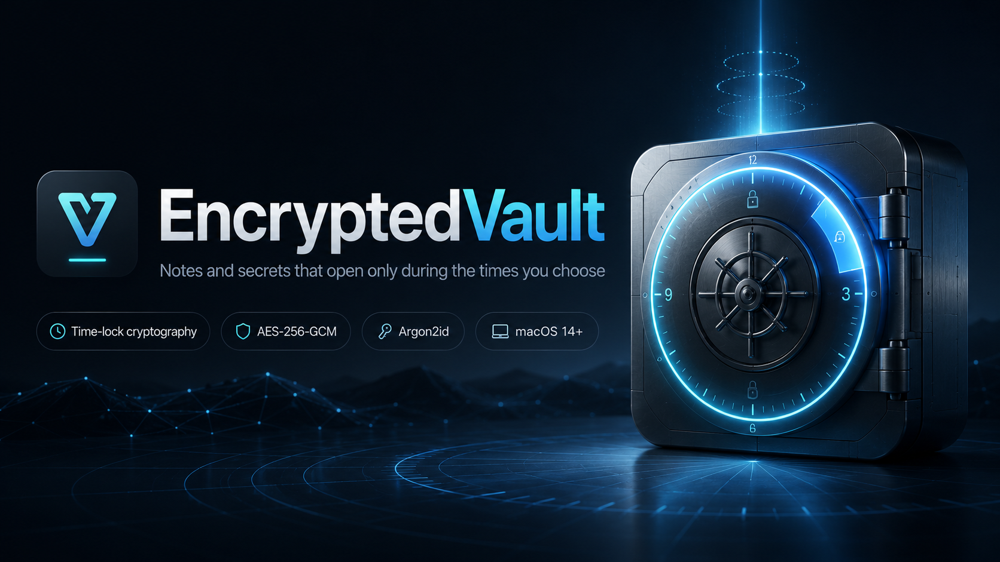

<div align="center">

# 🔒 EncryptedVault




### Notes and secrets that open **only** during the times *you* choose — even for you.

<br/>


</div>

<br/>

Most "locked" apps just put a password in front of your data. But if you know the
password, nothing actually stops you from opening it whenever you want — the lock
is a suggestion. **EncryptedVault is different:** outside your chosen window, the
key to decrypt the vault *does not exist on your machine yet*. There's nothing to
bypass, because there's nothing to unlock.

---

## ✨ Why you might want this

Some things are better on a schedule than on demand. EncryptedVault lets you bake
that schedule into the data itself, instead of relying on a setting you can quietly
turn off.

- ⏰ **Time-boxed access to credentials** — keep passwords, recovery codes, or
  logins reachable only during a set window each day, rather than always-on.
- 🧭 **A deliberate pause** — make content available only at a planned time, so
  opening it is a decision you made in advance.
- 🤝 **A commitment you can't casually undo** — once a window closes, the vault
  re-seals forward to the next one automatically. There's no "just this once"
  override, because the math doesn't have one.

> It's a tool for people who'd rather *design* their access up front than re-decide
> it every day.

---

## 🛠️ How it works

Two independent locks protect every vault:

#### 1. ⏳ Time-lock — the outer lock
The vault is sealed with [time-lock cryptography](https://drand.love/), built on
the public **drand** randomness beacon. Each window maps to a future beacon round,
and the key to open the vault becomes derivable *only once that round is published*.
Your Mac's clock plays **no part** in granting access — changing the system time,
using the Terminal, or editing the app does nothing. Only the real beacon, reached
over the network, opens the door, and only on schedule.

#### 2. 🔑 Password — the inner lock
Inside the time-lock, contents are encrypted with **AES-256-GCM**, with your key
stretched by **Argon2id**. So even a stolen copy of the sealed file is useless to
anyone without your password.

When a window ends — or when you lock, quit, or relaunch — the app **re-seals
forward** to the next window. A small background helper also re-seals any expired
vault on a timer, so a vault left open isn't left open. That helper can *only*
re-seal; it can never reveal contents. You can keep **multiple independent vaults**,
each on its own daily schedule.

---

## ✅ What it guarantees (and what it doesn't)

Being honest about the boundaries is part of the design.

| | Guarantee |
|---|---|
| 🟢 | **Can't open before the window** — enforced by cryptography. Not a clock check; not bypassable by changing the time or using the Terminal. |
| 🟢 | **A stolen file stays unreadable** — protected by the password + AES layer. |
| 🟢 | **Can't read after the window ends** — re-seals forward on lock, quit, relaunch, and on a background timer. |
| 🟡 | **During an open window** — contents are fully available; you can read, copy, and use them. That's the point of the window. |
| 🔴 | **A forgotten password** — no backdoor, no recovery. A lost password means the contents are gone for good. |

In short: it's a strong, real wall against opening something *outside* the time you
set for yourself. It is **not** a cage against someone who, during an open window,
deliberately copies the contents elsewhere — no local tool can prevent that.

---

## 📥 Download

Grab the latest build from the [**Releases**](../../releases) page, unzip it, and
move **EncryptedVault.app** to your Applications folder.

> The app is **ad-hoc signed** (not notarized), so on first launch macOS warns it's
> from an unidentified developer. **Right-click the app → Open**, then confirm — or
> run `xattr -dr com.apple.quarantine EncryptedVault.app`.

---

## 📋 Requirements

- 🖥️ **macOS 14+ on Apple Silicon.** A normal double-clickable `.app` — no
  command-line tool, no terminal setup.
- 🌐 **A network connection.** Opening and sealing a vault contacts the drand beacon
  (`api.drand.sh`). If your network filters outbound traffic, that host must be
  allowed or vaults won't open. The first-run check verifies this before you store
  anything.
- 👤 **No administrator account needed.** Runs entirely as a standard user.

---

## 🚀 First run

On first launch the app runs a quick on-device check — confirming encryption works
on your machine and that the time-lock network is reachable — *before* you store
anything. Then you choose a password, set one or more daily windows, add your notes
and secrets, and create the vault. It seals immediately to the next window.

> ⚠️ **Your password is the only thing that can ever open the vault, and it cannot
> be recovered.** Choose something you won't forget — and don't store the vault in
> Time Machine, iCloud, or any synced folder.

---

## 🧑‍💻 Building from source

```sh
./build.sh          # runs the full test gate, then produces build/dist/EncryptedVault.app
```

`build.sh` won't produce an app unless the test suite passes first.

| Document | What's in it |
|---|---|
| [docs/app.md](docs/app.md) | Design rationale and threat model |
| [docs/FORMAT.md](docs/FORMAT.md) | On-disk file format |
| [docs/SECURITY_INVARIANTS.md](docs/SECURITY_INVARIANTS.md) | The non-negotiable security properties |
| [docs/E2E.md](docs/E2E.md) | Live, across-a-real-window verification steps |

---

## 📄 License

Released under the [MIT License](LICENSE) — free to use, modify, and share.
